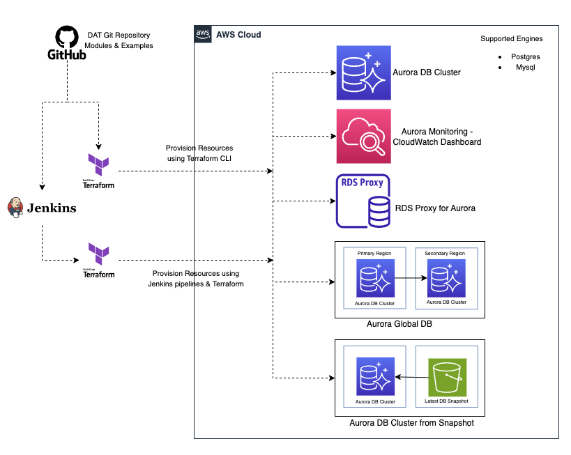

# Database Acceleration Toolkit (DAT) 
Welcome to the **Database Acceleration Toolkit (DAT)** !!! 

The **Database Acceleration Toolkit(DAT)** is an open-source Infrastructure-as-a-code based (Terraform) single click solution to simplify and automate initial setup, provisioning (day 1) and on-going maintenance (day 2 operations) for [Amazon Aurora](https://aws.amazon.com/rds/aurora/) database on AWS Cloud. 

It's designed to minimize the heavy lifting required for AWS customers to migrate from commercial databases such as SQL Server to Amazon Aurora and operating these databases in production.

## Architecture



## Documentation

To explore the complete project documentation, please visit our [documentation](https://aws-samples.github.io/aws-database-acceleration-toolkit/) site.

## Intended audience

The intended audiences for DAT are AWS customers who are migrating from commercial databases such as SQL Server to Amazon Aurora.

## Key Features

Key features of DAT include automation of initial aurora setup, provisioning and on-going maintenance activities,
1. Provisioning of new Aurora cluster
2. Provisioning of new [Aurora Global Database](https://aws.amazon.com/rds/aurora/global-database/)
3. Monitoring Aurora database 
	1. [Amazon CloudWatch](https://aws.amazon.com/cloudwatch/)
	2. [Amazon Managed Grafana](https://aws.amazon.com/grafana/)
	3. Curated CloudWatch and Grafana Dashboards
	4. Curated Performance Insights Dashboard for both Amazon CloudWatch and Amazon Managed Grafana
4. Provisioning and Integration with [RDS Proxy](https://aws.amazon.com/rds/proxy/) to reuse database connections and improved reliability
5. Provisioning of [AWS Data Migration Services (DMS)](https://aws.amazon.com/dms/) Instances to migrate data to Aurora
6. Restore cluster from S3

## Blueprint Examples

DAT comprises of below examples. Click each link to get more details on running these examples.
1. [aurora-postgres-cluster-existing-vpc](https://github.com/aws-samples/aws-database-acceleration-toolkit/tree/main/examples/aurora-postgres-cluster-existing-vpc) - Creates new Aurora Postgres Cluster.
2. [db-proxy-to-existing-postgres-cluster](https://github.com/aws-samples/aws-database-acceleration-toolkit/tree/main/examples/db-proxy-to-existing-postgres-cluster) - Creates proxy to existing Aurora Postgres.
3. [aurora-postgres-cluster-global-db](https://github.com/aws-samples/aws-database-acceleration-toolkit/tree/main/examples/aurora-postgres-cluster-global-db) - Creates new Aurora Postgres Clusters in Primary and Secondary region.
4. [aurora-monitoring](https://github.com/aws-samples/aws-database-acceleration-toolkit/tree/main/examples/aurora-monitoring) - Setup monitoring dashboard for aurora.

## Getting Started

This section demonstrate how you can leverage DAT to provision new cluster.

## Prerequisites

First, ensure that you have installed the following tools locally.

1. [aws cli](https://docs.aws.amazon.com/cli/latest/userguide/install-cliv2.html)
2. [kubectl](https://kubernetes.io/docs/tasks/tools/)
3. [terraform](https://learn.hashicorp.com/tutorials/terraform/install-cli)

## Deployment Steps

The following steps will walk you through the deployment of `aurora-postgres-cluster-existing-vpc` example blueprint. This example expects you to leverage an existing VPC and provision a new Aurora Cluster with one writer and one reader instance. However you can customize the reader and writer instances:

### Step 1: Clone the repo using the command below

```sh
git clone https://github.com/aws-samples/aws-database-acceleration-toolkit.git
```

### Step 2: Review and update the terraform.tfvars
Navigate to `aurora-postgres-cluster-existing-vpc` under `aws-database-acceleration-toolkit/examples` folder. 

```shell script
cd aws-database-acceleration-toolkit/examples/aurora-postgres-cluster-existing-vpc
```
Review the Terraform variable definition file called `terraform.tfvars` and update the values for the variables as per your use case. 

```
# (mandatory) AWS Region where your resources will be located
region = "<AWS_REGION>"

# (mandatory) VPC Id where your database and other AWS resources will be located. 
# For example: "vpc-0759280XX50555743"
vpc_id = "<VPC_ID>"

# (mandatory) Instance class. 
# For example: "db.t4g.micro" is a free tier instance 
instance_class ="<DB_INSTANCE_CLASS>"

# (mandatory) Database Engine for your Aurora Cluster. Options: "aurora-postgresql" or "aurora-mysql" 
# For example: "aurora-postgresql"
engine = "<DB_ENGINE>"

# (mandatory) Number of instances 
instances = {
    one   = {}
    two   = {}
}

# (optional) Default is "provisioned" database cluster; For serverless, select "serverless"
engine_mode = "<DB_ENGINE_MODE>"

# (optional) The database engine version. Note -Updating this argument results in an outage" 
# For example: "15.3"
engine_version = "<DB_ENGINE_VERSION>"

# (optional) Database cluster name, for example 'aurora-pg-poc'
# For example: "aurora-pg-poc"
name = "<DB_CLUSTER_NAME>"

# (optional) Database environment
# For example: "dev"
environment = "<ENVIRONMENT>"

# (optional) Tagging : Team/Group Name
# For example: "dev"
groupname = "<TEAM_GROUP_NAME>"

# (optional) Tagging : Project or Application Name
# For example: "dev"
project = "<PROJECT_NAME>"

```
The example below illustrates how to use the 'region' variable to define the AWS region for your database-related resources.
```shell script
region = "us-east-2"
```

### Step 3: Run Terraform Init
Initialize a working directory with configuration files by running `terraform init` 

```shell script
terraform init
```

### Step 4: Run Terraform Plan
Verify the resources created by this execution using `terraform plan`

```shell script
terraform plan -var-file terraform.tfvars
```

### Step 5: Terraform Apply
To create resources by running `terraform apply` commands

```shell script
terraform apply -var-file terraform.tfvars
```

### Cleanup: Terraform Destroy

To clean up your environment, destroy the AWS resources created 

```sh
terraform destroy -var-file terraform.tfvars
```

## Associated Cost

DAT is an open-source solution and is completely free to use. However, you will be responsible for any AWS costs associated with running your Aurora clusters and other AWS services.

## Support 

DAT is supported by Solution Architects of AWS on best effort basis. However, users are encouraged to ask questions, open issues, contribute and provide feedback on DAT.

## Next Steps

Currently, DAT supports PostgreSQL only. MySQL database engine is on the short-term roadmap. 

## Security

See [CONTRIBUTING](CONTRIBUTING.md) for more information.

## License

This library is licensed under the MIT-0 License. See the [LICENSE](LICENSE) file.
