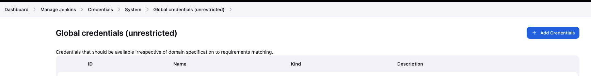
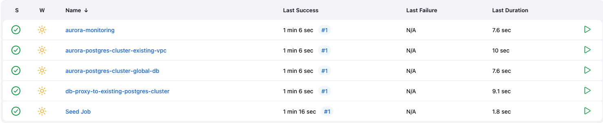
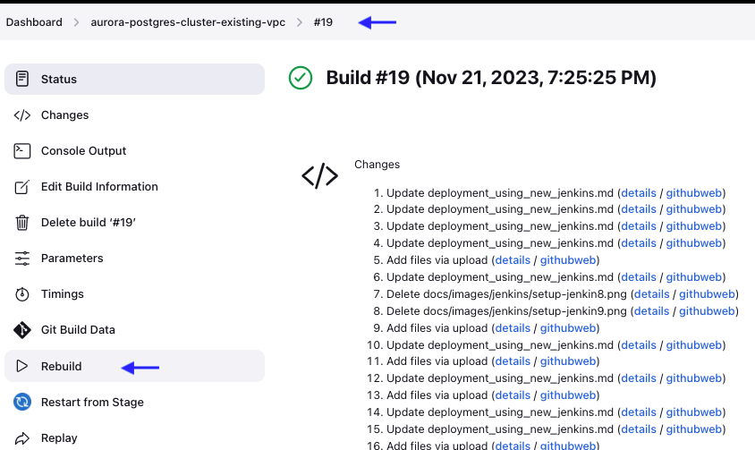
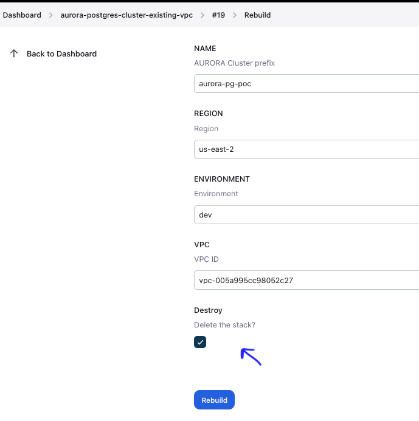

# Deployment Steps using Existing Jenkins 

The following steps will walk you through the deployment of toolkit using your own Jenkins and running pipelines DAT modules. We assume that the basic installation of the Jenkins server is available either locally or on one of the virtual machines. If not, use [Deployment Steps using new Jenkins](https://github.com/aws-samples/aws-database-acceleration-toolkit/blob/main/docs/deployment_using_new_jenkins.md) deployment approach.

1. Step 1 - Setup Job DSL Plugin in Jenkins
2. Step 2 - Configure Seed Job
3. Step 3 - Add AWS credentials in Jenkins
4. Step 4 - Configure DAT pipelines for examples in Jenkins
5. Step 5 - Run pipelines to deploy DAT modules

### Step 1: Setup Job DSL Plugin in Jenkins

Job DSL plugin is required to setup DAT pipelines. Validate if Jenkins already have it installed and enabled by going to Manage Jenkins -> Plugins -> Installed Plugins

To install DSL Plugin go to Manage Jenkins -> Plugins -> Available Plugins

Search for "Job DSL" and install. Make sure plugin is enabled after installation

### Step 2: Configure Seed Job

Seed job is used to configure deployment piplelines.

Browse Jenkins url and click "New Item" under Dashboard

Enter an Item name as "Seed Job"

Select "Freestyle Project" -> Click Ok

Once redirected to Configure page enter below values

Source Code Management: select git and enter "https://github.com/aws-samples/aws-database-acceleration-toolkit" in Repository URL and branch name as "*/main"

In Build section add build steps and select Process Job DSLs

Select checkbox "Look on Filesystem" and enter "pipelines/seed_jobdsl.groovy" value in DSL Scripts as shown below and click Save

### Step 3: Add AWS credentials in Jenkins

 
1. Navigate to `Dashboard` -> `Manage Jenkins` -> `Credentials` -> `System`

   

2. Navigate to `Global Credentials(unrestricted)` and click `Add credentials`.
3. Enter AWS credentials of your environment, make sure you enter **jenkinsaws** in the ID field.

   

### Step 4: Configure DAT pipelines for examples in Jenkins

1. Navigate to `Dashboard` in Jenkins. you will see `Seed job` pipeline created by default. It is used to setup `example` pipelines. 
2. Schedule a build for `Seed Job` by clicking green button. Job takes 2-5 seconds to complete and you will see addtional pipelines on the console.

   

3. you will see additional pipelines for **DAT examples** on the console

   
   
### Step 5: Run pipelines to deploy DAT modules
The below section describes steps for deploying `aurora-postgres-cluster-existing-vpc` module using pipelines.  The same steps are applicable for other modules also. 

### 1. Deploy `aurora-postgres-cluster-existing-vpc` module

This **aurora-postgres-cluster-existing-vpc** example expects you to leverage an existing VPC and provision a new Aurora Cluster with one writer and one reader instance. However you can customize the reader and writer instances

1. Navigate to `Dashboard` in Jenkins and select the `aurora-postgres-cluster-existing-vpc` module. Select `Buid with Parameters` option.
   
   

3. Enter the input parameters and click `Build`

   

`Note: It takes 12-15 minutes to setup RDS in your vpc. You can navigate to AWS console and search for RDS.` 

### 2. Destroy `aurora-postgres-cluster-existing-vpc` module
1. Navigate to `Dashboard` in Jenkins and select the `aurora-postgres-cluster-existing-vpc` module. Select the Job that created the successful aurora cluster,
2. Select `Rebuild` option and review the input parameters and make sure it reflects the aurora db cluster that you want destroy.

   
   
4. Select `Destroy` checkbox and click `Rebuild`
 
   

`Note: It takes 12-15 minutes to destroy RDS in your vpc. You can navigate to AWS console and verify` 

