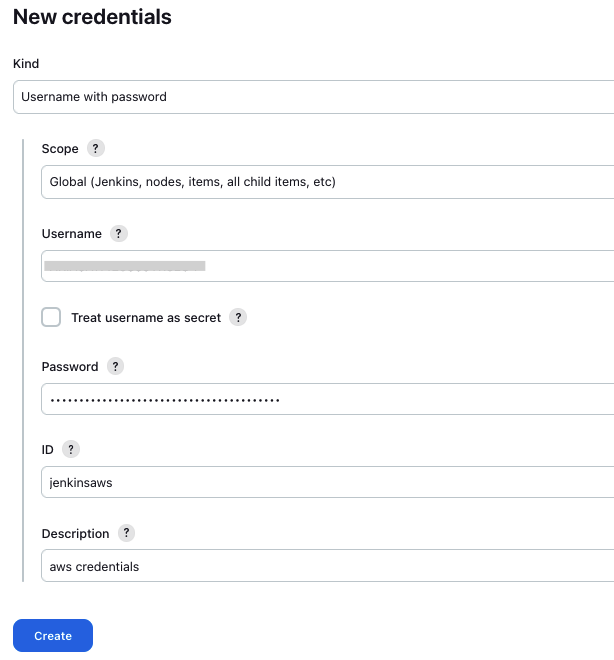

# Deployment Steps using New Jenkins Setup

The following steps will walk you through the deployment of toolkit using Jenkins and running pipelines DAT modules. 

1. Step 1 - Setup new Jenkins in Ec2
2. Step 2 - Jenkins User Setup
3. Step 3 - Configure Jenkins
4. Step 4 - Run Jenkins pipelines and deploy DAT modules
5. Step 5 - Destroy Jenkins

## Step 1: Setup new Jenkins
The steps below guide you to create new EC2 instance in  VPC and install Jenkins on the docker in EC2.

### 1. Clone DAT repository
```sh
git clone https://github.com/aws-samples/aws-database-acceleration-toolkit.git
```

### 2. Review and update the terraform.tfvars

Goto `aws-database-acceleration-toolkit` -> `pipelines` -> `Jenkins`  folder. 

```shell script
cd aws-database-acceleration-toolkit/pipelines/Jenkins
```

Review the Terraform variable definition file called `terraform.tfvars` and update the values for the variables as per your use case. 

```
# (mandatory) AWS Region where your resources will be located
region = "us-east-2"

# (mandatory) VPC Id where your database and other AWS resources will be located. 
# For example: "vpc-0759280XX50555743"
vpc_id = "vpc-042229eafe1a7f93f"
```
### 3. Run Terraform Init
Initialize a working directory with configuration files by running `terraform init` 

```shell script
terraform init
```

### 4. Run Terraform Plan
Verify the resources created by this execution using `terraform plan`

```shell script
terraform plan -var-file terraform.tfvars
```

### 5. Terraform Apply to create Ec2 instance and setup Jenkins
To create resources by running `terraform apply` commands

```shell script
terraform apply -var-file terraform.tfvars
```

Once terraform apply is completed, console will show EC2 IP address as output. Save this IP address, we need this to login to jenkin console.


`Note : It takes 2-3 minutes for Jenkins installation after terraform apply is complete. Wait till Status check is completed in EC2 console`


## Step 2: Unlock Jenkins & Setup user
1. Browse jenkin url **http://[jenkins_ip]:8080** by replacing **[jenkins_ip]** with EC2 IP address copied in step 1. You will get the below Jenkins console 


3. To get the admin password, we need to login to Ec2 instance where Jenkin is deployed and run below commands
```shell script
sudo docker exec -it jenkins-docker bash
cat /var/jenkins_home/secrets/initialAdminPassword
```


5. Copy the AdminPassword and enter into the Jenkins console and click `continue`
6. Select `Install suggested plugins` Option
7. Complete First Admin User setup


7. Jenkin Initial setup is done
   


## Step 3 - Configure Jenkins

### 1. Add AWS credentials in Jenkins

1. Login to (http://[jenkins_ip]:8080) using the admin user credentials 
2. Navigate to `Dashboard` -> `Manage Jenkins` -> `Credentials` -> `System`


4. Navigate to `Global Credentials(unrestricted)` and click `Add credentials`.
5. Enter AWS credentials of your environment, make sure you enter **jenkinsaws** in the ID field.



### 2. Configure DAT pipelines for examples in Jenkins

1. Navigate to `Dashboard` in Jenkins. you will see `Seed job` pipeline created by default. It is used to setup `example` pipelines. 
2. Schedule a build for `Seed Job` by clicking green button. Job takes 2-5 seconds to complete and you will see addtional pipelines on the console.


3. you will see additional pipelines for **DAT examples** on the console


   
## Step 4: Run pipelines to deploy DAT modules
The below section describes steps for running `aurora-postgres-cluster-existing-vpc` module.  The same steps are applicable for other modules also. 

### 1. Deploy `aurora-postgres-cluster-existing-vpc` module

This **aurora-postgres-cluster-existing-vpc** example expects you to leverage an existing VPC and provision a new Aurora Cluster with one writer and one reader instance. However you can customize the reader and writer instances

1. Navigate to `Dashboard` in Jenkins and select the `aurora-postgres-cluster-existing-vpc` module. Select `Buid with Parameters` option.
   
   

2. Enter the input parameters and click `Build`

   

`Note: It takes 12-15 minutes to setup RDS in your vpc. You can navigate to AWS console and search for RDS.` 

### 2. Destroy `aurora-postgres-cluster-existing-vpc` module
1. Navigate to `Dashboard` in Jenkins and select the `aurora-postgres-cluster-existing-vpc` module. Select the Job that created the successful aurora cluster,
2. Select `Rebuild` option and review the input parameters and make sure it reflects the aurora db cluster that you want destroy.
   
   
   
4. Select `Destroy` checkbox and click `Rebuild`
   
   

`Note: It takes 12-15 minutes to destroy RDS in your vpc. You can navigate to AWS console and verify` 

## Step 5: Destroy Jenkins

### Cleanup: Terraform Destroy - This will destroy Ec2 instance and Jenkins 

To clean up your environment, destroy the AWS resources created 

Goto `aws-database-acceleration-toolkit` -> `pipelines` -> `Jenkins`  folder. 

```shell script
cd aws-database-acceleration-toolkit/pipelines/Jenkins
```

Run Terraform destroy 

```sh
terraform destroy -var-file terraform.tfvars
```
