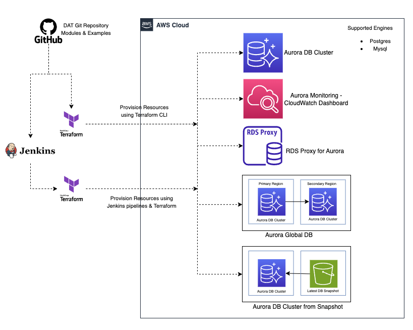

Welcome to Database Acceleration Toolkit(DAT) !

The **AWS Database Acceleration Toolkit(DAT)** is an open-source Infrastructure-as-a-code based single click solution to simplify and automate initial setup, provisioning and on-going maintenance for [Amazon Aurora](https://aws.amazon.com/rds/aurora/) database on AWS Cloud. 

It's designed to minimize the heavy lifting required for AWS customers to migrate from commercial databases to Amazon Aurora database and operating these databases in production.

**Key Features**

Key features of DAT include automation of initial Amazon Aurora setup, provisioning and on-going maintenance activities,

1. Provisioning of new [Amazon Aurora database cluster](https://aws.amazon.com/rds/aurora/)
2. Provisioning and Integration with [RDS Proxy](https://aws.amazon.com/rds/proxy/) to reuse database connections and improved reliability
3. Provisioning of new [Aurora Global Database](https://aws.amazon.com/rds/aurora/global-database/)
4. Monitoring Aurora database 
5. Restore cluster from Snapshot 

**Architecture** 

Below is the high level architectre of Database Acceleration Toolkit. 

